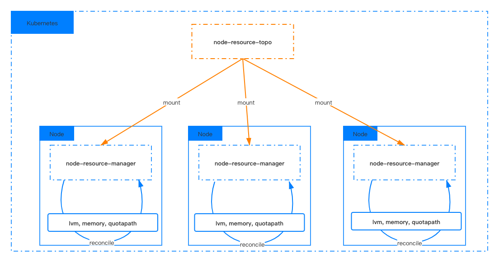

# openyurtio/node-resource-manager

English | [简体中文](./README.zh.md)

Node-resource-manager manages local node resources of OpenYurt cluster in a unified manner. 

It currently manages:
- LVM built on top of block device or pmem device.
- QuotaPath built on top of block device or pmem device.
- Memory built on top of pmem device. 

The majority function consists of:
- Initialize local resources on edge node.
- Update local resources on edge node.

You can define the spec of local resources by simply modifying the pre-defined ConfigMap.

Node-resource-manager has the following advantages in terms of compatibility and usability.
- **Easily to use**. Initialization and modification of local resources are easily done by editing the ConfigMap.
- **Easily to integrate**. Node-resource-manager can work together with csi driver, to perform local storage lifecycle management.
- **Platform free**. Node-resource-manager can be running in any kubernetes clusters.

## Architecture
The component consists of two parts, the first part is the ConfigMap named node-resource-topo in kube-system namespace,
and the second is the node-resource-manager DaemonSet deployed in kube-system namespace.
Node-resource-manager on each node mounts and reads the node-resource-topo ConfigMap to managed local resources.
<div align="center">
  
</div>

## Getting started

1. Create node-resource-topo ConfigMap in kube-system namespace. ConfigMap example is in [configmap.md](./docs/configmap.md).
```
kubectl apply -f deploy/configmap.yaml
```

2. Deploy node-resource-manager DaemonSet.
```
kubectl apply -f deploy/nrm.yaml
```

## Developer guide

Please refer to [developer-guide.md](./docs/developer-guide.md) for developing and building the project.

## Roadmap

[2021 Roadmap](docs/roadmap.md)
