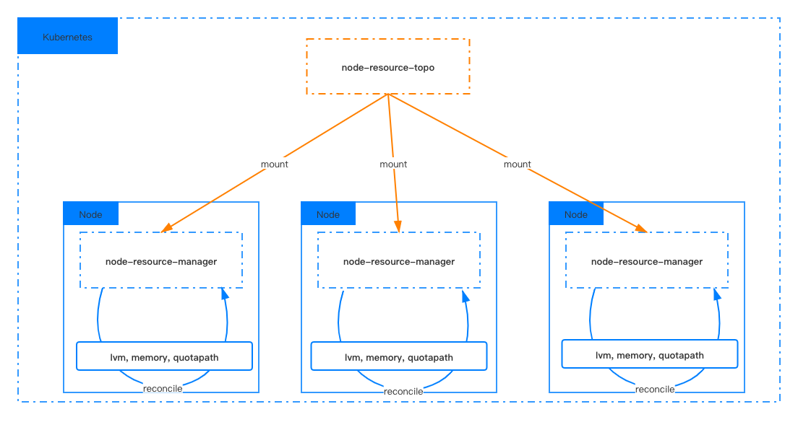

# openyurtio/node-resource-manager

[English](./README.md) | 简体中文

node-resource-manager 是用于管理 OpenYurt 集群本地资源的组件，用户可以通过修改集群内 ConfigMap 的定义来动态配置集群内宿主机上的本地资源。

管理的本地资源包括：
- 基于块设备或者是持久化内存设备创建的 LVM
- 基于块设备或者是持久化内存设备创建的 QuotaPath

主要功能包括：
- 初始化节点上本地资源
- 更新节点上的本地资源

主要优点：
- **简单易用**。node-resource-manager 可以仅通过定义 ConfigMap 就完成对集群中的本地资源的初始化和更新 
- **易于集成**。 node-resource-manager 可以与 csi 插件集成来完成 kubernetes 集群中的相关本地资源的生命周期管理
- **与云平台无关**。 node-resource-manager 可以轻松部署在任何公共云 Kubernetes 服务中。

## 架构

该组件主要包含两个部分， 一个是定义在集群中 kube-system namespace 的 node-resource-topo ConfigMap,
一个是部署在集群中 kube-system namespace 下面的 node-resource-manager Daemonset, 
每个 Node 节点上的 node-resource-manager 通过挂载 node-resource-topo ConfigMap 的方式生产并管理用户定义的本地资源。
<div align="center">
  
</div>

## 开始使用

1. 在 Kubernetes kube-system namespace 下定义 node-resource-topo ConfigMap, 该 ConfigMap 用于定义集群中需要自动生成并管理的节点本地资源. 关于如何创建一个ConfigMap，请参见 ConfigMap [定义](./docs/configmap.zh.md)

```
kubectl apply -f deploy/configmap.yaml
```

2. 在 Kubernetes 集群中创建 node-resource-manager Daemonset。
```
kubectl apply -f deploy/nrm.yaml
```

3. 检查在 ConfigMap 上定义的资源是否都已经在对应的节点上被正确的创建。


4. 配合 [alibaba-local-csi-plugin](https://help.aliyun.com/document_detail/178472.html?spm=a2c4g.11186623.6.844.13a019caYIiivY) 插件在集群中动态创建本地资源 pvc/pv, 供 pod 进行挂载使用。

## 开发指南

请参考 [developer-guide.md](./docs/developer-guide.md) 进行本项目的开发和构建。

## 发展规划

[2021年 发展规划](docs/roadmap.md)